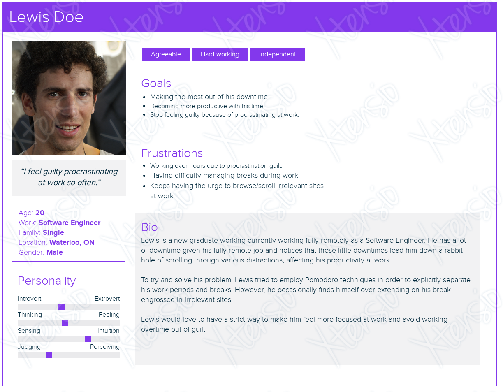
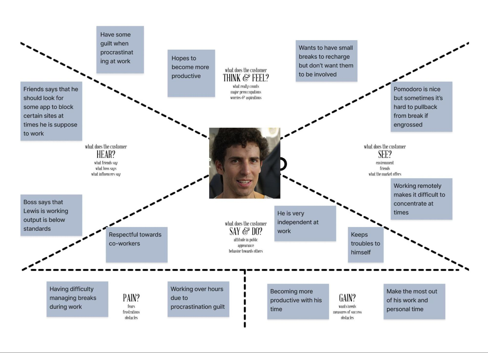
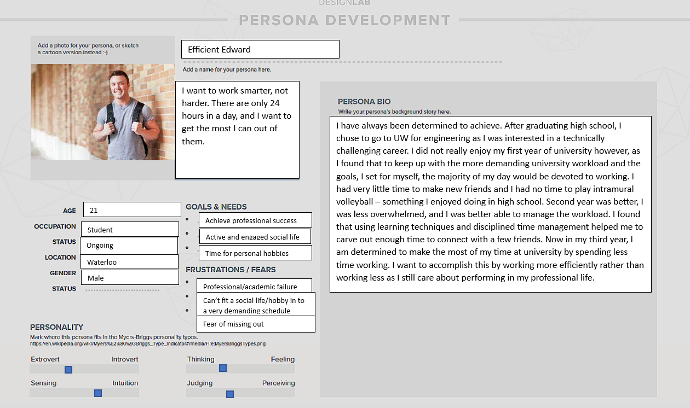
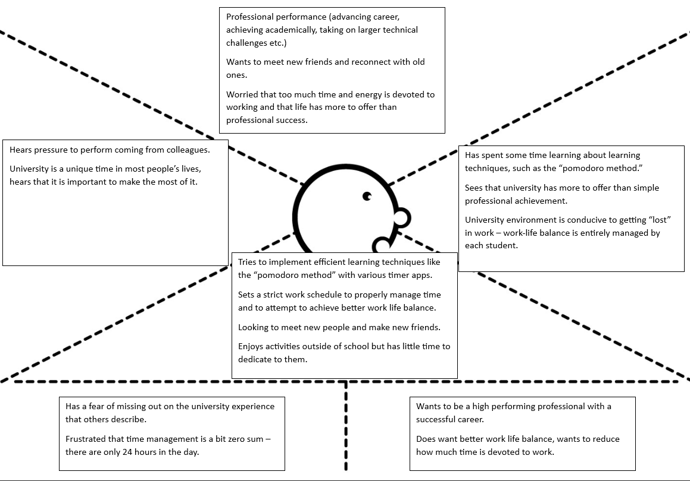
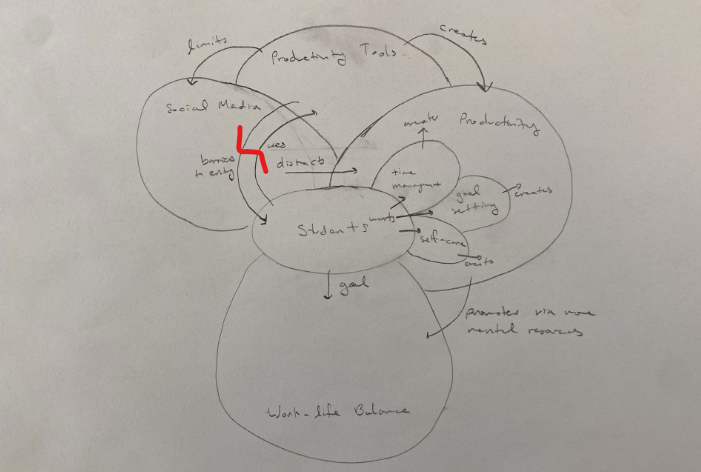
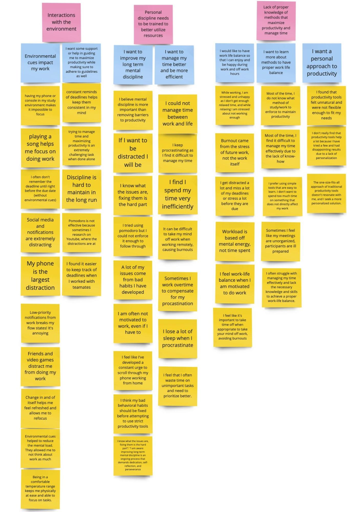

## Product Anticipated Users

To achieve a better understanding of potential customers and users for the project, we created several personas that represent people who are affected by issues of work life balance. The aim is to find out concerns about the work life balance in order to design an app to manage work and personal time effectively.

We focused primary on the audience group of students and young working professionals:

### 1. Lewis Doe

Lewis is a new graduate currently working fully remotely as a Software Engineer. He has a lot of downtime given his fully remote job, and notices that these little downtimes lead him down a rabbit hole of scrolling through various distractions, affecting his productivity at work.

To try and solve his problem, Lewis tried to employ Pomodoro techniques in order to explicitly separate his work periods and breaks. However, he occasionally finds himself over-extending on his break engrossed in irrelevant sites.

Lewis would love to have a strict way to make him feel more focused at work and avoid working overtime out of guilt.

The following shows Lewis' persona:

---

The following shows Lewis' empathy map:

---

### 2. Efficient Edward

Edward is a third year student studying at the University of Waterloo. He has always been a bit of a high performer and wants to continue to achieve professional success after he graduates. As a result, his first and second year at university was mostly dedicated to doing work. Fearing that he is missing out on other important aspects of university (like enjoying time with friends). He has attempted to make his working hours more efficient so he can spend less time working for the same results. He does this through learning new learning techniques and careful time management. However, he is still not satisfied with the results and is continuing to search for more efficient ways of working.

The following shows Lewis' persona:

---

The following shows Lewis' empathy map:

---

## User Interviews

Overall, we did 6 informational user interviews to gather information about the problem space with real-world user stories we can use as we design our application. We interviewed mostly students but also a few working professionals to get different perspectives. The average age of participants was X, and the gender distribution is Y. Z% of participants had trouble with work-life balance or productivity.

In order to conduct and analyze the user interviews, we prepared a set of high level questions and extensions for each component to gather user stories and valuable insights when it comes to viewing productivity and work-life balance. After our initial informational user interview, we got enough information to start analyze the problems we actually need to solve, we did this be using the responses to create a cultural work model. Using this work model, we concluded that there is a correlation between effective productivity, mental capacity, and work-life balance. This gave us the confidence to design a productivity app for people who are struggling with productivity.

The following shows our cultural work model:

---

As we got more feedback, we created a affinity an diagram that got updated overtime in order to keep track of the key problems we need to address along with specific user stories under each problem.

The following shows our affinity diagram after all informational interviews:

---

Most interviews were successful as we gathered new perspectives, user stories we can use in our development, and other various suggestions to help us with our designing process. Here are our key takeaways from each interview:

### Interview 1

- Work life balance was measured in mental resources expended, not time.
- Environmental cues were very important to affecting participant behavior, not abstract concepts like scheduling.
- Issues surrounding productivity and work were much longer term, the challenge was not identifying them then applying a fix, but actually finding a solution that worked long term to change patterns of behavior.

---

### Interview 2

- Work-life balance is defined as maintaining a healthy life outside of work while still achieving professional growth. It involves proper time management, setting boundaries, and prioritizing self-care.
- Consistent productivity is considered an important component of work-life balance as it allows for efficient completion of academic tasks, creating more time for leisure activities and personal interests.
- Strategies and tools such as creating a conducive study environment, using time management techniques like the Pomodoro Technique, and utilizing productivity apps or tools are employed to stay focused during work hours.

---

### Interview 3

- Another perspective for work life balance is a work-culture that promotes growth and freedom without any toxicity. Having a workplace that promotes employees to work in a motivated manner can also keep mental resources high.
- Distracting people in their work state could be negatively impact productivity.
- Effective productivity platforms should have low entry barriers along with “training” phases to quickly build effective habits that are maintainable.
- Knowing when to take breaks and taking your mind off work is also key to work-life balance.

---

### Interview 4

- Not everyone is looking for productivity solutions and a lot of them might just be good with going with the flow. However, they could be open to ones if recommended to them and would likely enjoy a tool that seamlessly integrates into their life.
- Distractions from social media and video games are likely some of the biggest factors in procrastination.
- This participant is very used to using a Calendar.

---

### Interview 5

- Interviewee prefers consistent work schedules and is willing to work every day, including weekends, due to two reasons:
  - Days off are "tainted" by the anticipation of more work the next day, so they prefer to do some work on off-days to lighten the load.
  - They find it essential to have some time off daily, prioritizing work even on off-days to avoid consecutive days without rest.
- Environmental factors significantly impact the interviewee's mental energy expenditure:
  - In a structured environment with team interactions, tasks are easier to manage and require less mental effort.
  - Without clear environmental cues, tasks become more challenging and demand more mental energy to stay on track.
- The interviewee values change for the sake of refreshment and refocusing:
  - Reorganizing their workspace has improved their work performance by providing a sense of refreshment.
  - Incorporating proper rotation between working activities in product schedules can optimize user focus and productivity while avoiding overwhelm.

---

### Interview 6

- The participants value work-life balance and see it as crucial for their overall well-being. They prioritize being present and focused on tasks both at work and during personal time.
- The participants face challenges in maintaining consistency and overcoming distractions. They struggle with task management, overestimation, and leaving tasks unfinished, leading to stress and anxiety.
- The participants have experimented with various productivity tools such as calendars, notes, and communication platforms. They find value in using tools like Microsoft Outlook and calendar apps to better organize their tasks. They also utilize mediums like sticky notes and iPad for different work-related activities.
- The participants believe that work-life balance can be improved through training mental discipline. They use strategies like blocking distractions during work sessions to stay focused. They recognize the role of technology in supporting self-control and routine development.
