## Initial Design Ideas

After user interviews, we concluded there is a correlation between effective productivity, mental capacity, and work-life balance. This gave us the idea to work on a productivity app that is made to improve work-life balance in the long-term. We aimed to create an application that integrates homogenous productivity methods which gets tailored to each user, while removing any initial barriers for our target audience. We also wanted some positive reinforcements to help users stick to their good habits in order to achieve better work-life balance. Given this, we decided on four major features:

- Organic Pomodoro Timer
- Goal Tracking
- AI-assisted/generated Calendar
- Collaboration/Network

### The User Stories & Storyboards

Given our major features, we worked on formalizing user needs along with a concrete story board.

#### Organic Timer

> _**As a user, I want to timeblock my work sessions and minimize my distractions so I can be productive while avoiding burnouts**_

- As a user, I need to block out distractions I accidentally come across
- As a user, I want to easily switch between timeblocked work and break sessions
- As a user, I want my work session duration to be longer if I enter flow states
- As a user, I want my work session duration to be shorter if I stop focusing on work midway
- As a user, I want to make it easy for me to start working
- As a user, I want to avoid digging into rabbit holes during my small break sessions
- As a user, I want some notification to tell me to stop procasinating

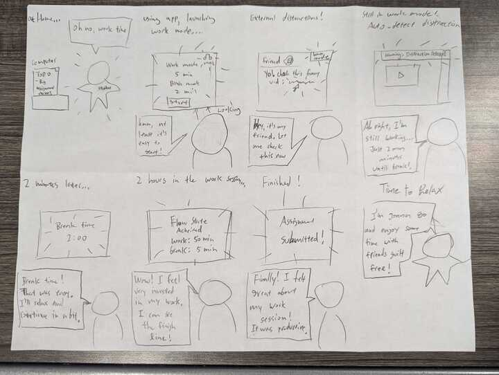

#### Goal Tracking

> _**As a user, I want to be motivated to work while keeping track of my progress to measure how productive I am.**_

- As a user, I want to know how closely I was able to follow the schedule
- As a user, I want help with knowing what to do and when to maximize productivity
- As a user, I want to make sure that I can track my habits while working towards a goal
- As a user I want to be motivated to be productive by gamifying some aspects of being productive
- As a user I would like to keep track of achievements or awards that I have attained to measure how well I am doing according to the schedule
- As a user I would like to add goals on the go and make sure to track them at a high and low level

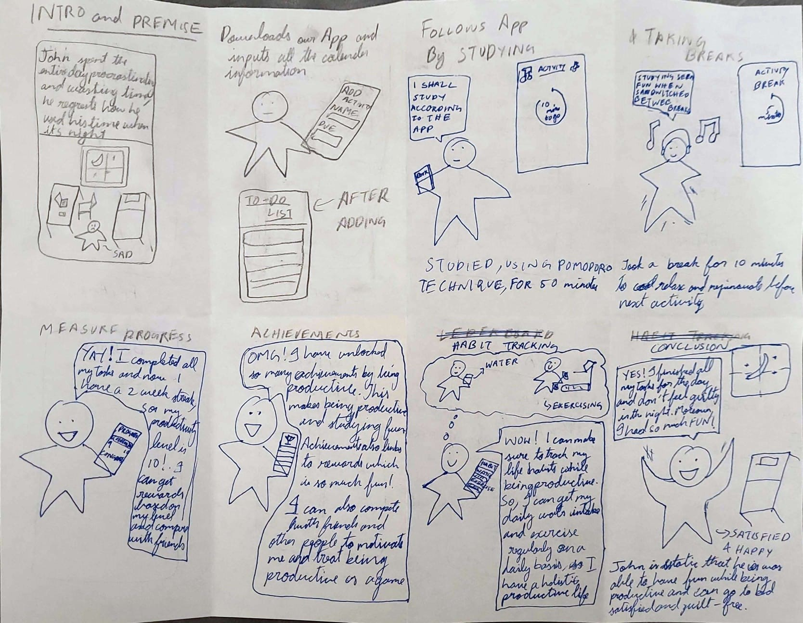

#### Collaborative Features

> _**As a user, I want to work with my friends and colleagues to be productive so that we can motivate each other and be on the same schedule**_

- As a user I need to add my friends/colleagues on the app
- As a user, I need to schedule work sessions with my peers and configure the work sessions to the constraints that I desire
- As a user, I want to gain points for time spent in work sessions for rewards and compete against my peers

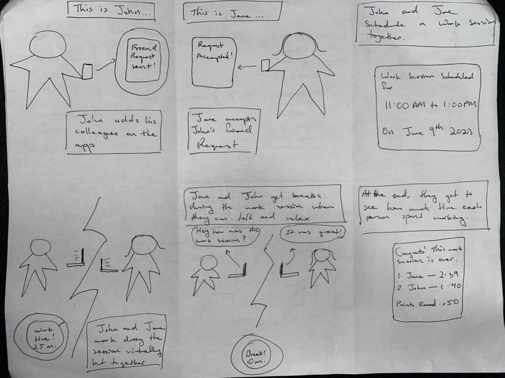

#### AI Generated Calendar

> _**As a user, I want a schedule that allocates time for my personal work sessions around scheduled events so that I can remain on track to accomplish my goals**_

- As a user I need to add my currently scheduled events to the app calendar
- As a user, I need to be able to create goals and allocate time estimates
- As a user, I want a calendar to be generated that allocates enough time to each goal in the day so that I have designated work times
- As a user, I need multiple reminders of upcoming deadlines to ensure that I can keep track of my priorities
- As a user, I need a calendar that reflects decisions I make each day to ensure that I still can remain on track despite deviating from my planned schedule

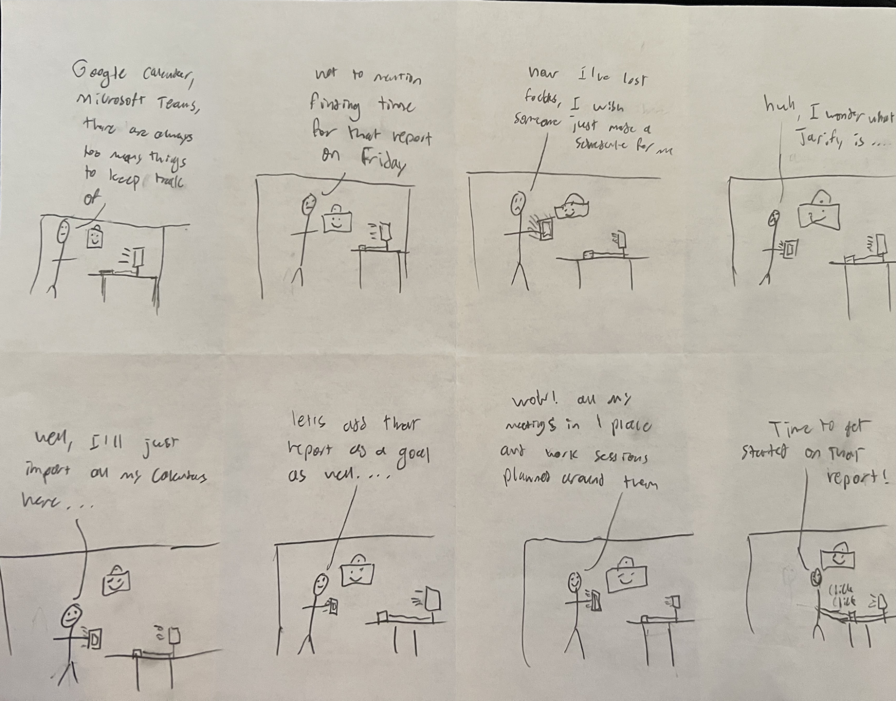

## Paper Prototypes

After thinking through our user stories, we started creating sketches, user flows, and the first draft of our paper prototypes:

#### Crazy 8's

##### Organic Timer

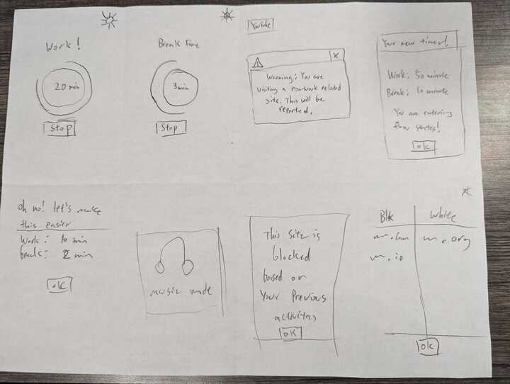

##### Goal Tracking

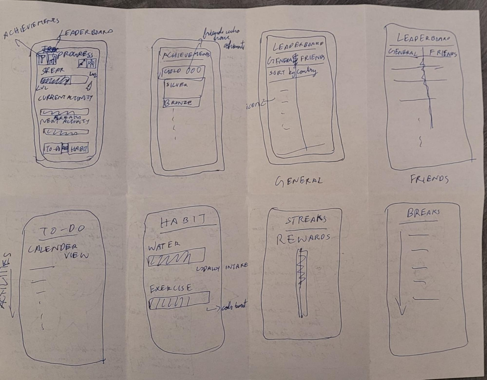

##### Collaborative Features

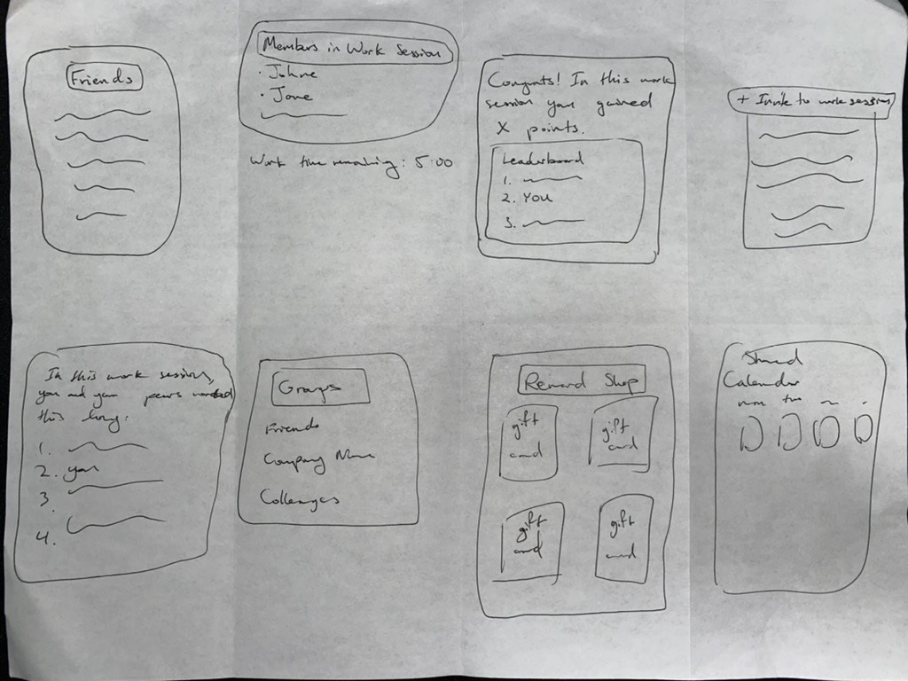

##### AI Generated Calendar

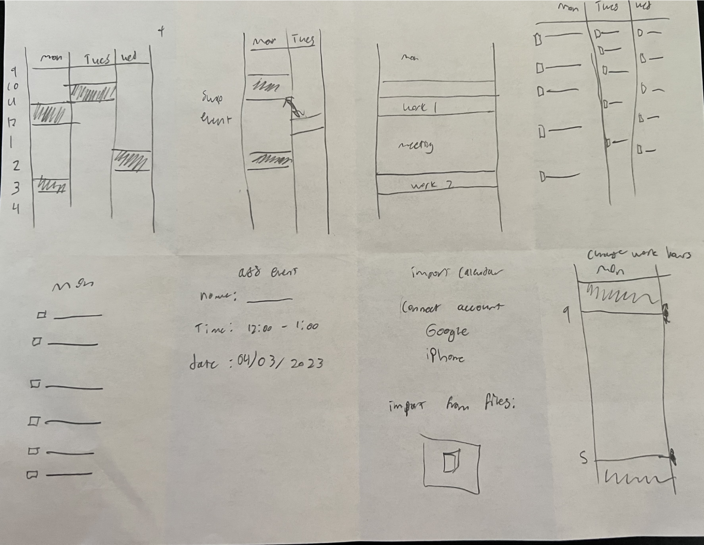

#### User Flow

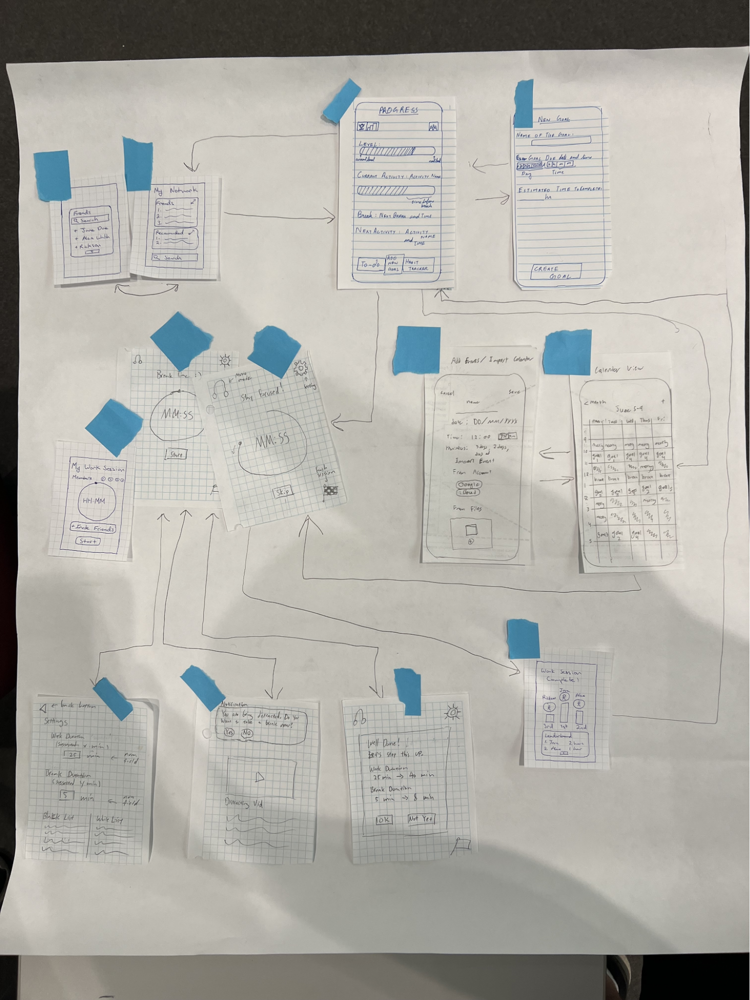

#### Paper Prototype/Initial Wireframe

##### Organic Timer

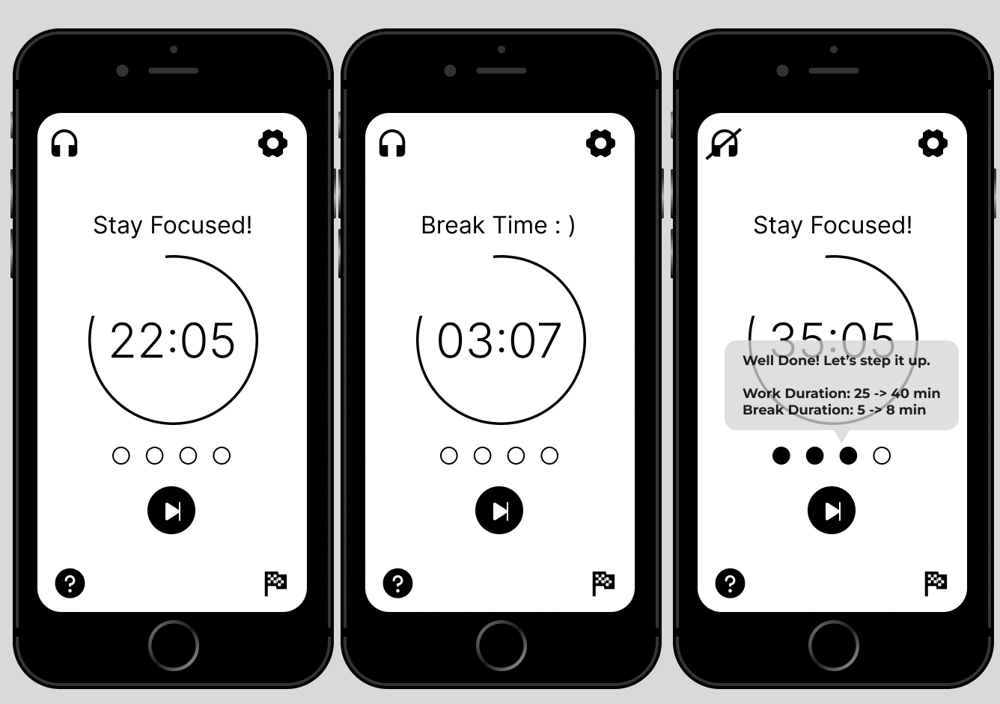

##### Goal Tracking

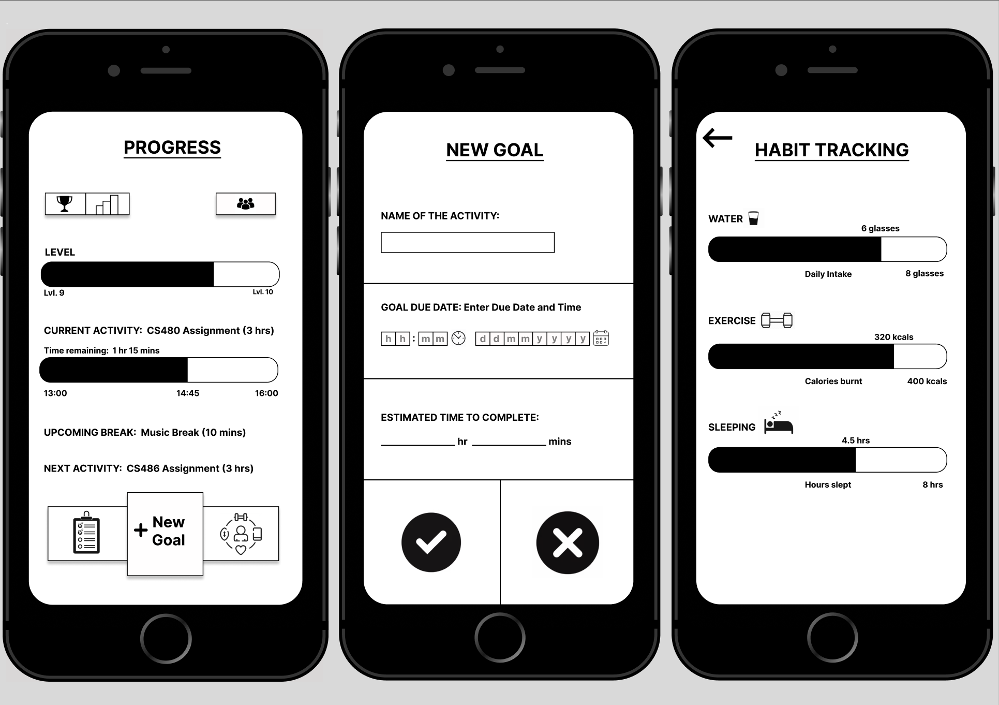

##### Collaborative Features

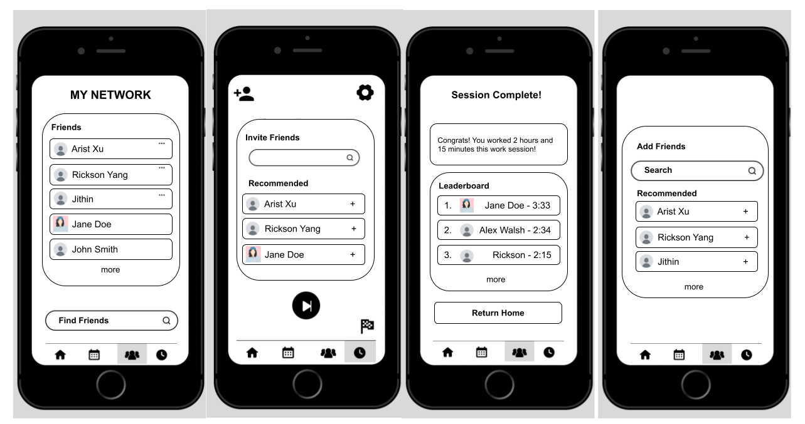

##### AI Generated Calendar

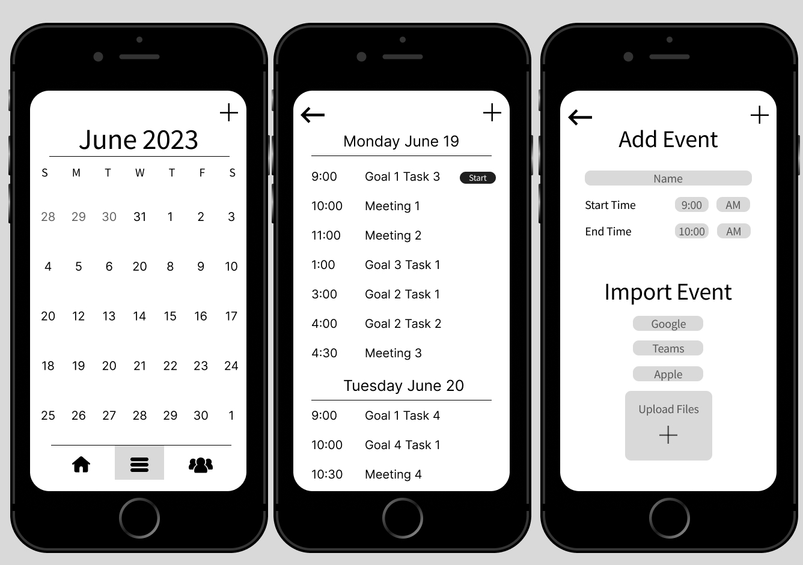

#### Paper Prototype Evaluation

##### Goals & Hypotheses

Our goal is to create a user experience that is simple and easy to pick up. A user should
be able to easily use the application and start building good habits intuitively.

We hypothesized that:

- The UI is, minimal, clear, and intuitive
- All of our initial features in the paper prototype have meaningful uses
- Our users can easily pick up new productivity tools

##### Tasks

To prepare for the prototype evaluation, we prepared 3 major tasks for participants:

- Create a new goal.
- Import a calendar event and start a work session.
- Add a friend and add them to the work session, then end the work session.

These tasks together simulate the approximate workflow that we believe users will go through when using our app. Together, these tasks incorporate all 4 major features and should give a high level overview of whether our assumptions about user workflows are correct.

##### Results

Observations:

- Organic timer view was initially missing a way to navigate across the other pages
- Some features in the organic timer like music mode seems unnecessary
- Navbar was not standardized across views, besides the calendar page, there was no navbars
- Navbar was missing a way to get back to organic timer view
- Collaboration views navigation link was unclear
- Collaborating was missing some views and had to made clearer
- Unified the collaboration and organic timer work session screens
- Goal-tracking navigation icon buttons are unclear
- Goal tracking requires a readjustment to accommodate the navbar and remove repeated icons
- Customizability unavailable on the habit-tracking page
- Missing implementation of achievement or leaderboard page

Changes:

- Navbar was updated to include a link to the organic timer view
- A navbar was added to the organic timer view, collaboration, and goal-track/home views
- Changed music mode button in organic timer to invite friend to work session
- Added organic timer view for cases where there is no ongoing/scheduled work session
- Added added a settings icon to habit tracking for customizability

## Design Iterations

The team had many opportunities to have users evaluate prototypes of Zentopia. Our prototype consistently evolved iteration after iteration:

### Iteration 2 (After paper prototype above)

#### Design changes for points of confusion:

- Organic timer: All users treat the skip button in the timer as start/stop, infers that it is a skip button after use as shown
- Smart calendar: Confirm event button (plus icon) is unintuitive due to similar placements in previous pages as shown
- Goal-tracking: Habit management button (gear icon) is unintuitive as shown
- Goal-tracking: Habit tracker button is unintuitive, labels might help as shown
- Goal-tracking: When the user wanted to go the daily schedule, they occasionally mistakenly chose the calendar icon.

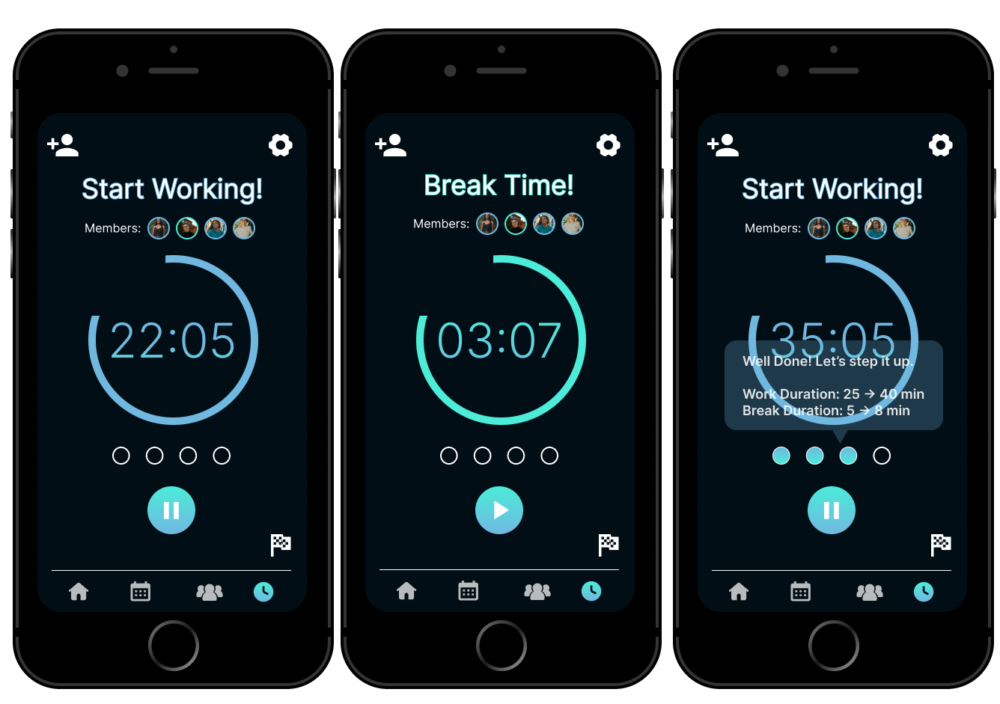
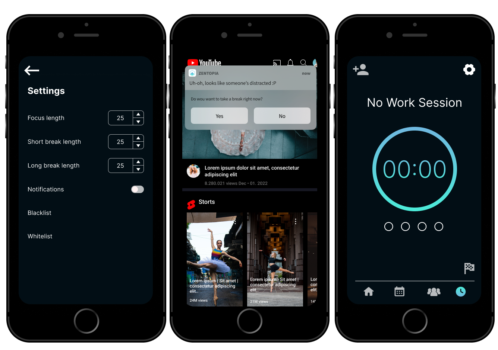
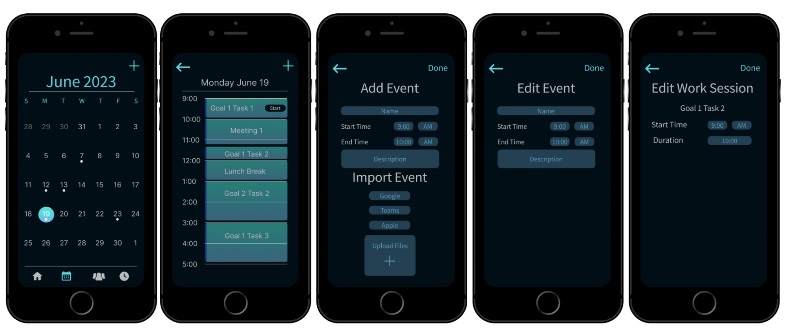

### Iteration 3

#### Design changes for points of confusion:

- The navigation bar seemed a little bit ‘older’ and a little less contemporary, maybe try to remove the white divider bar and see
- The goal tracking app home screen seems to not highlight the next activities etc as much as it should, it feels like that is the actual important part of the feature
- Colours on the Smart Calendar flow feel very muted compared to the rest of the app. Try using white text rather than grey to make the text easier to read and give it more contrast.
- There are some inconsistencies between flows for the Title Bars. The titles in the Calendar flow are grey, larger and not underlined whereas in the Goal Tracker flow, the titles are white, smaller and have less padding on top
- Remove whitelist/blacklist as it does not seem to important to the overall flow of the application
- Try putting the search bar under MY NETWORKS at the top, so that users are more likely to search through their contacts than scroll
- Could create more vertical space in the Add Event page to make it less cramped. Organizing content into columns of one or two in a form makes it easier for the user to navigate as suggested in Figure 1

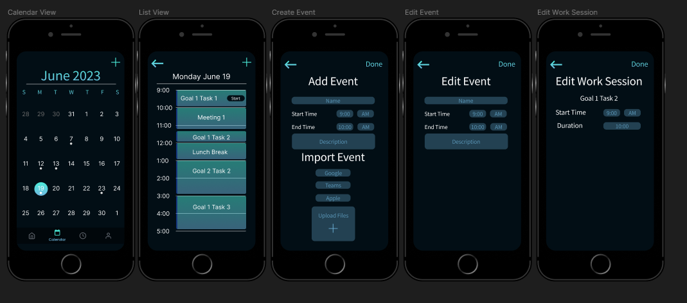
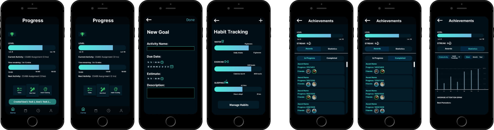

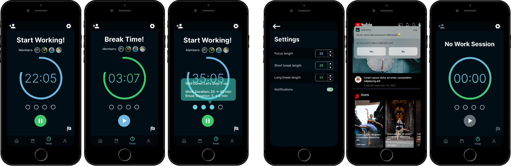
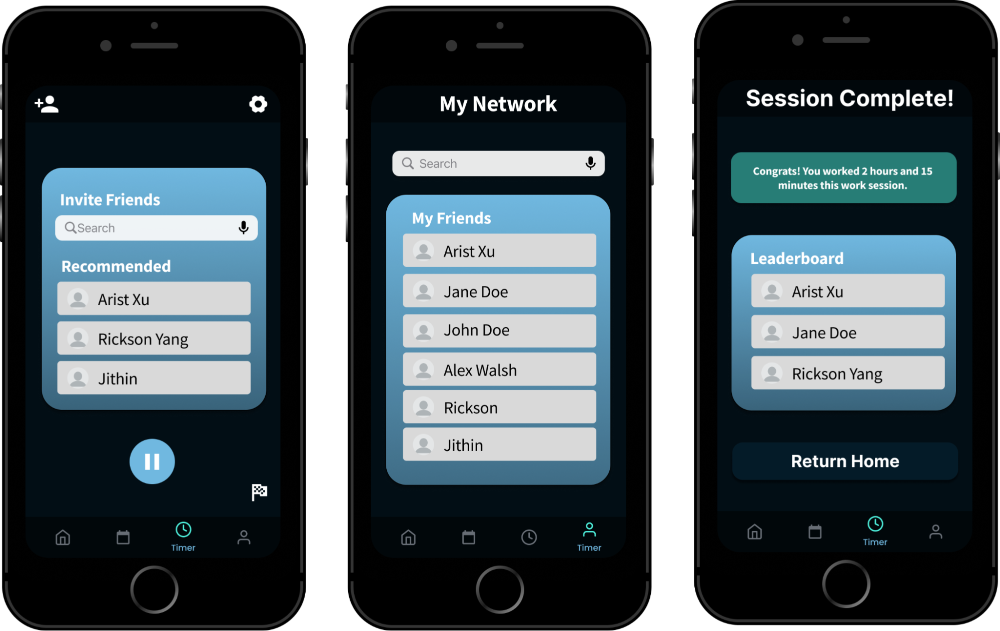

### Iteration 4

- We noticed that our collaboration feature was rather vague so we reiterated the design to make it more complete

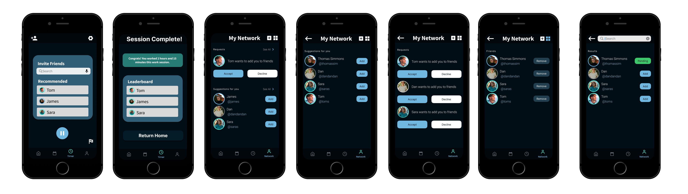
