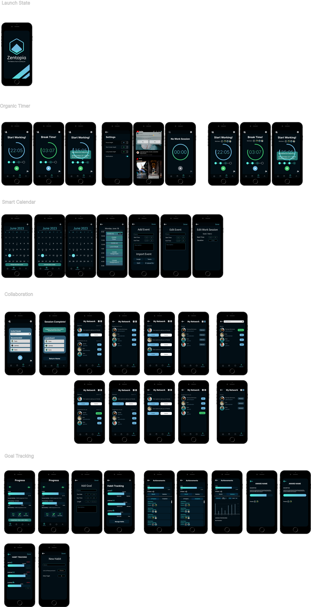

## Formulating Evaluation Study Goals

### 3 High Level Tasks
#### 1. Fill in your calendar by adding goals and events

From this scenario, we want to learn if users intuitively can find how to accomplish this as it is the core of our app. We also want to learn if users are directed towards using these features at the start of their workflow and that users do pick up on the distinction/app specific technicalities of events and goals (ie that a goal is a personal project, an event is a regular calendar item, that goals will create auto generated calendars that work around events etc).

#### 2. Start a work session and add a friend to it

From this scenario, we want to learn if users can intuitiively interact with the pomodoro timer flow without too much guidance. This flow is one of the main features of our app as a tailored productivity tool that builds long term habits for success. From this task, we expect to gather information on any hesitancy and confusion that the user feel while in doing this task, we want to make any necessary changes and convey that this flow is easy to get started with and will help with good long term habits. Questions we want to answer through this evaluation is if we need any better hints for the users to understand the flow, if we should remove any unforeseen distractions.

#### 3. Check on your goal progress to better reflect your progress and change schedule to showcase customizability

From this scenario, we want to learn if users intuitively can navigate the goal progress pages. This is an important feature of our app that allows users to understand and keep track of their progress, it also provides users with achievements and awards to make sure they are motivated to be productive, hence understanding this flow is important for better user retention. From this task, we expect to gather information based on if the users understand what each icon means and how easily they can obtain information regarding their habit tracking progress, productivity and habit tracking statistics, achievements and awards, or friends page that they are looking for. And even complete tasks regarding changing or updating the schedule according to their requirements. The answers to these questions would better help us improve the flow of the app, iconography, and if there are any complications within our app.

### Chosen Heuristics To Study
1. Match between system and the real world
2. User control and Freedom
3. Recognition rather than recall
4. Aesthetic and minimalist design
5. Flexibility and efficiency of use

### Plan for Cognitive Walkthrough (Expected Sequences for Tasks)

#### Fill in your calendar by adding goals and events
1. User clicks on New Goal button from home screen
2. User fills in relevant input fields, including the name, due date, and estimated time of the task
3. User clicks done button and is brought back to home screen
4. User navigates to calendar screen by clicking on calendar icon in nav bar
5. User click on the plus icon at the top right of the calendar screen
6. User fills in relevant information to create an event, such as date or time, or clicks import event
7. User clicks done button and is brought back to the main calendar screen

#### Start a work session and add a friend to it
1. Go the the network page and briefly explore your network and manage your friends in the application like any other social media
2. Go to the home page and click on the tasks button and start on the currently scheduled task
3. Treat it like a pomodoro timer, wait for 2 cycles (10 second delay or so…)
4. Try clicking on the homepage while working to simulate “procrastination”
5. Invite some friends to work with you
6. Finish the work session

#### Check on your goal progress to better reflect your progress and change schedule to showcase customization
1. (If not already in the home page) Go to the goal progress page
2. User clicks on the achievements icon to display the achievements and awards page
3. User views in progress achievements, and also information on each achievement
4. User clicks on completed achievements, to view completed achievements
5. User clicks on statistics icon
6. User explores the statistics page using varies time metrics(week, month, year) for different factors(productivity performance, habit tracking)
7. User clicks back button to return to the home page (goal progress page) 
8. User clicks on the icon for the current schedule
9. User changes the schedule as desired
10. User clicks back button and is brought back to the main screen

## Heuristics Evaluation

### 1. Match between system and the real world

We chose this heuristic because we want it to be easy for users to pick up the application, especially if they have already tried productivity application in the past. One of our key success metric is to have a low barrier of entry to make it easy to be productive, so we want to get this right.

Results:
- General language and easy to understand
- "Network" page can be changed to "Friends" page
- Organic Timer flow-state progression UI are not intuitive, the dots are reminiscent of image swiping UI

### 2. User control and Freedom

We chose this heuristic to ensure that our application is easy to navigate across. We want to make sure that it is easy to perform actions and to undo actions when possible in order to reduce friction with the goal of improving productivity.

Results:
- Navigation across screens is intuitive, back arrows for certain sub pages to make it easy to traverse through flows

### 3. Recognition rather than recall

We chose this heuristic for the similar goal of minimizing the usage barrier for users. We want to ensure we are minimizing the user's memory task as an application that is trying to increase user mental capacity.

Results:
- Relative info are present when required (eg: creating new task, goals)
- Having a tutorial on what the progress bar is in the organic timer would help with initial recognition

### 4. Aesthetic and minimalist design

We chose this heuristic to ensure we convey key details clearly within our app. We also want to ensure we give off a professional and welcoming aesthetic for users that are looking to get into productivity apps for the first time.

Results:
- UI is simple
- Dark theme looks great
- Some unobvious icon buttons should be labelled, like the achievements icon
- There are some clickable text components in the homepage that are not obvious, they should be emphasized
- Some nitpicks with spacing across various pages

### 5. Flexibility and efficiency of use

We chose this heuristic to ensure our app is easy to pick up for users with a range of productivity tool experience.

Results:
- UI is simple, discovering new features was simple and streamlined
- No notable negatives

## Cognitive Walkthrough

After having multiple rounds of cognitive walkthroughs from experienced UI/UX critiques, here are our findings:
- Requires validation on if a task or event has been created, user were able to navigate relatively easily
- Took a while to find the correct icon, some users got lost after entering the work session mode, but were able to complete the task after that
- Goal progress reached by only one user, other users seemed confused by what were goal progress and was unclear on it
- Make the area of sensitivity larger for easier navigation
- Phone screens are not all uniform in size
- More interactions on the goal progress page, to make it less static. Eg: adding a scrollbar and implementing few awards

## Final Designs Changes

After our Heuristic Evaluation and Cognitive Walkthrough, here are our listed changes:
- Improve the flow-state display bar to something more understandable by the users
- Increase more pages to be implemented for the sake of improving the flow and interaction
- Implement larger click-area for buttons to make them more easily accessible
- Fix workflow bug related to showing no work in progress even after adding one.
- Split the statistics icon from achievements and hence make it more meaningful.
- Add feedback for event creation and updating similar to the creation of a new goal

Here is our final design after reflecting those changes:

