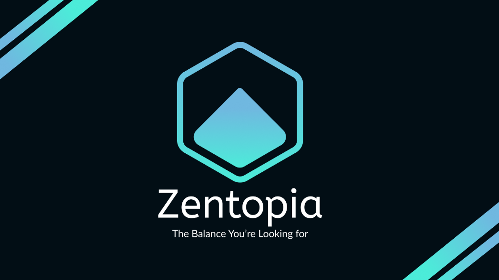

Our team's most successful work practices can be attributed to the transparent communication and our diligent effort to split work and responsibilities in a manner that everyone contributed something meaningful. This approach not only fostered inclusivity but also allowed us to explore our individual strengths and apply them to the project. Our team's strength also lies in the exceptional support and camaraderie we fostered amongst ourselves as we all learned about UI/UX concepts for the first time. Our supportive work culture provided a comfortable environment where every team member felt encouraged to express their ideas and opinions freely, fostering creativity and collaboration. The unwavering support we provided to one another not only boosted morale but also enhanced our collective productivity and made working together a truly enjoyable and rewarding experience. Overall, we believe our app offers a unique approach at effective productivity tools and addresses the problem with work-life balance and productivity.

Nonetheless, we did face criticism in terms of our design. We believe our design didn't directly communicate that our productivity tools are tailored to individual users with ongoing usage. We believe this could be better articulated if we had some kind of onboarding flow for first time users. Some of our features are still rather vague in terms of their value proposition, such as the habit tracking pages. If we could re-do this project again, we would streamline our project and cut out unnecessary features as soon as we can. This is so that we can put all of our focus on key features that aligns with our core value proposition, making them more fleshed out with any onboarding flows.
